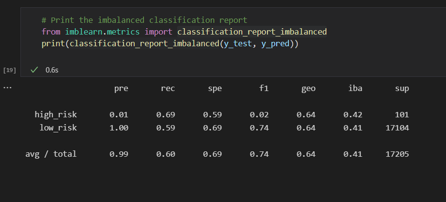
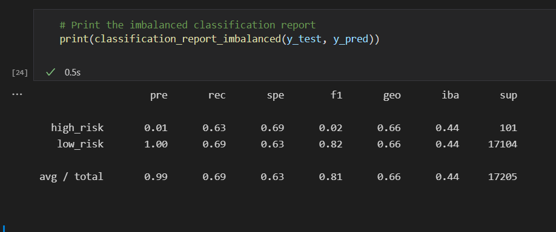
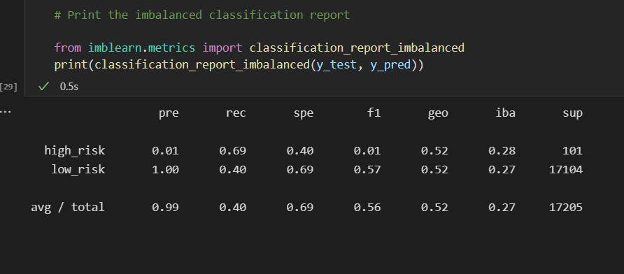
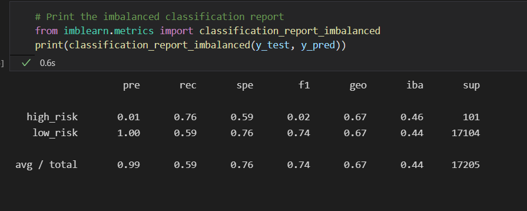

# Credit_Risk_Analysis :house_with_garden:

## OSU Module 17 Challenge - Supervised Machine Learning

#### Using the credit card credit dataset from LendingClub, a peer-to-peer lending services company, you’ll oversample the data using the RandomOverSampler and SMOTE algorithms, and undersample the data using the ClusterCentroids algorithm. Then, you’ll use a combinatorial approach of over- and undersampling using the SMOTEENN algorithm. Next, you’ll compare two new machine learning models that reduce bias, BalancedRandomForestClassifier and EasyEnsembleClassifier, to predict credit risk. Once you’re done, you’ll evaluate the performance of these models and make a written recommendation on whether they should be used to predict credit risk.

Overview of the analysis: A dataset with many contributing factors will be broken down into features and targets, encoded, scaled, and measured to determine what models are best used to assess credit risk and what are the main contributing factors in determining a successful loan.

  * Since credit risk is inherently unbalanced, different sampling models will be tried and compared.
  * We will under/over and use a combination method while sampling the data.
  * Finally we will use Ensemble learning to figure out the largest contributing features from our list of nearly 100 columns.

Results: Using bulleted lists, describe the balanced accuracy scores and the precision and recall scores of all six machine learning models. Use screenshots of your outputs to support your results.

  * Random Oversampling
  
  * SMOTE
  
  * Random Undersampling
  
  * Combination
  

Summary: Summarize the results of the machine learning models, and include a recommendation on the model to use, if any. If you do not recommend any of the models, justify your reasoning.

  *
  *
  *
